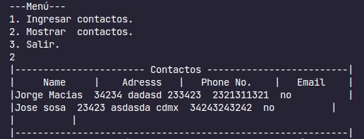

# Agenda

Hola, esta es mi primera aplicación de consola echa con el lenguaje C++.

Es una pequeña agenda que te permite almacenar información en un archivo de texto y acceder a esta cuando desees.

